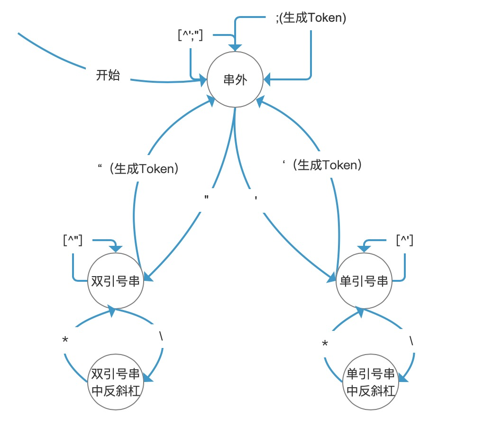

# 分割SQL语句
## 背景
SQL语句的DDL和DML根据分号划分。
之前的对一组SQL语句的切分有问题。出现 '\\\\' 会出现切割错误。
例子如下：
```java
CREATE TABLE student (id INT, name STRING, age INT) USING CSV;
SELECT *, split(q,'\\\\') as qq FROM foo_table;
SELECT * FROM bar_table;
```
上面代码无法被splitIgnoreQuota()方法正确切割成三句SQL。

#### 指导思想
想从编译原理的词法分析角度解决这个问题。实现一个DFA（确定有限状态自动机）。只要状态转换图是对的。那么解析的字符串一定是对的。

# 技术方案
#### 步骤

1. 使用状态机将字符串Token化。
   1. 将字符串转换成Token数组。
2. 根据Token重组成SQL语句。
   1. 根据Token数组中的Token类型，拼接成一个一个SQL语句，组成SQL数组。

主干代码就如下两步：
```java
String string = "一坨SQL语句";
List<Token> tokens = tokenize(s);
List<Token> tokens = tokenize(string);
return processTokens(tokens);
```
### 一、状态机的实现
#### 状态机转换图
下图中，每一个节点都代表一种状态，每一条边都代表一个函数。
每当路过需要生成Token的边，就把缓冲区中所有字符保存到Token中。

#### 状态机五种状态：
```java
private enum State {
    /** current char in single quote */
    SINGLE_QUOTED,
    /** current char in single quote，and after '\' */
    AFTER_BACKSLASH_SINGLE_QUOTED,
    /** current char in double quote */
    DOUBLE_QUOTED,
    /** current char in double quote，and after '\' */
    AFTER_BACKSLASH_DOUBLE_QUOTED,
    /** out of quote */
    UNQUOTED
}
```
#### 切换状态的三种关键字
分隔符不在关键字中，动态传入。
```java
public class Keyword {
    public static final char SINGLE_QUOTE = '\'';
    public static final char DOUBLE_QUOTE = '\"';
    public static final char BACKSLASH = '\\';
}
```
### 二、Token的实现
```java
public class Token {

    private TokenKind kind;
    private String val;

    Token(TokenKind kind, String val) {
        this.kind = kind;
        this.val = val;
    }
    
    public TokenKind getKind() {
        return kind;
    }

    public String getVal() {
        return val;
    }
}
```
Token只有两种类型
```java
/** There are only two kinds */
private enum TokenKind {
    /** SQL string */
    STRING,
    /** SQL delimiter */
    DELIMITER
}
```
#### Token使用举例
在如下SQL例子中，转换出的一个Token数组是这样[STRING, STRING, STRING, DELIMITER, STRING, DELIMITER]。那么会根据SEMICOLON类型，最终还原出两句SQL。
```java
SELECT *, split(q,'\\\\') as qq FROM foo_table;
SELECT * FROM bar_table;
```

# 参考资料
《现代编译原理:C语言描述》——第2章 词法分析

#### 参考代码
Flink StructuredOptionsSplitter类 splitEscaped（）方法。
