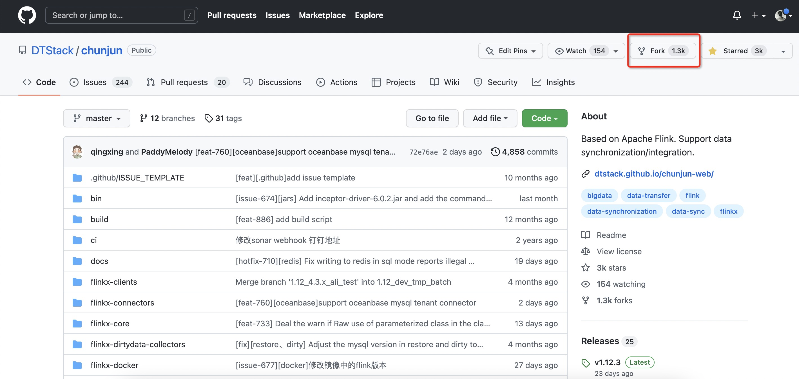
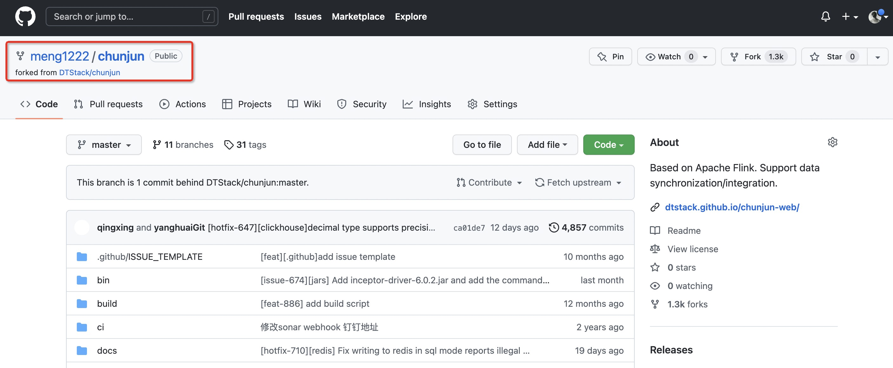
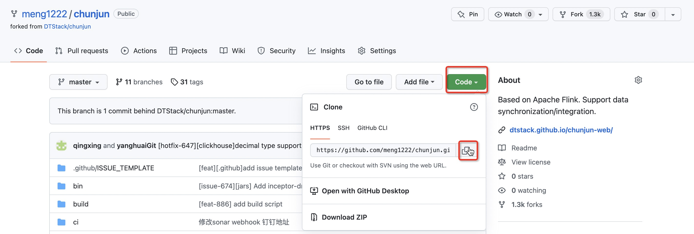
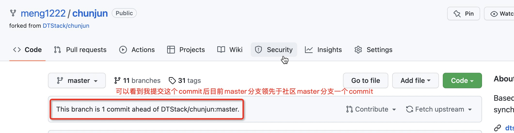
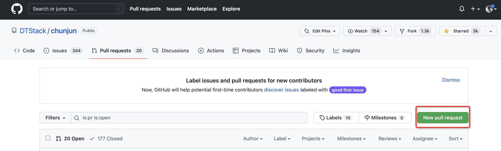
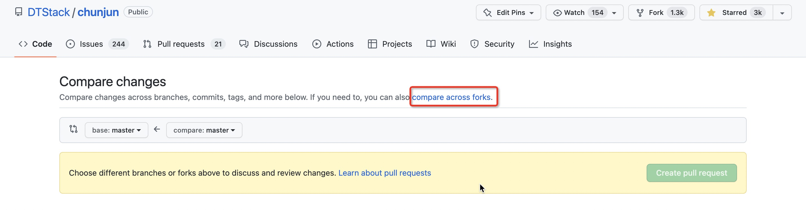
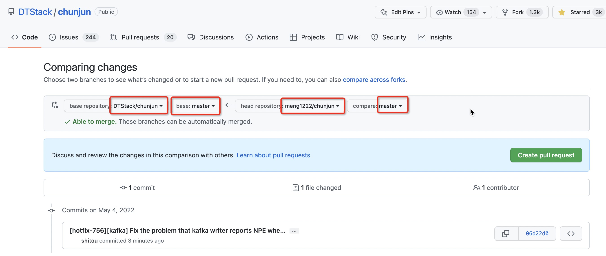
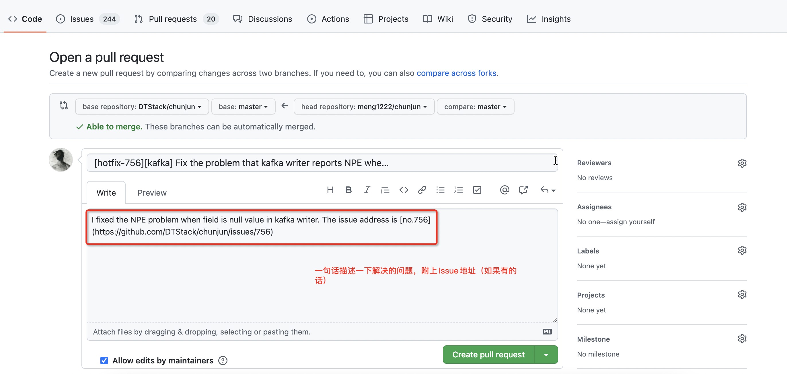
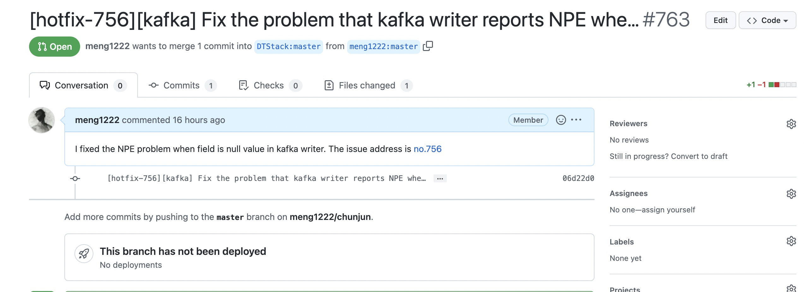

# How to submit a good PR
Submitting pr on github is an important way to participate in the open source of the chunjun project. Small partners can submit pr contribution code to the community for some features or bugs in use, or provide their own solutions according to existing issues.

## Step 1: Fork chunjun to your own github repository


After clicking fork, you can see the chunjun project named after you in your repository:



## Step 2: clone chunjun to the local IDE


## Step 3: Set DTStack/chunjun as the remote branch upstream of the local repository
```shell
$ cd chunjun
# add upstream
$ git remote add upstream https://github.com/DTStack/chunjun.git
# view your remote repository settings
$ git remote -v
origin  https://github.com/your_name/chunjun.git (fetch)
origin  https://github.com/your_name/chunjun.git (push)
upstream    https://github.com/DTStack/chunjun.git (fetch)
upstream    https://github.com/DTStack/chunjun.git (push)
```
## Step 4: Submit the code
Any commit should be based on latest branch.
**switch branch**
```shell
# Fetch branches from upstream.
$ git remote update upstream -p
# Checkout a new branch.
$ git checkout -b branch_name
# Pull latest code into your own branch.
$ git pull upstream master:branch_name
```
**After modifying the code locally, submit a commit**
- commit_message format：
[commit_type] [module] message
- commit_type:
    - feat：Indicates a new feature（feature)
    - hotfix：hotfix，fix bug
    - docs：Changes and additions to documents
    - opt：Modify the code style and opt imports without changing the original executed code
    - test：add test
- eg:[hotfix-12345][mysql] Fix mysql time type loses precision.

```shell
# code formatting before submitting a commit
$ mvn spotless:apply
$ git commit -a -m "<you_commit_message>"
```
**rebase remote branch**

This step is very important, because the chunjun code in our warehouse is likely to have lagged behind the community, so we need to rebase before push commit to ensure that our commit is based on the latest code of the community, many small partners do not have this step, resulting in the submitted pr Include other people's commits
```shell
$ git fetch upstream
$ git rebase upstream/branch_name
```

*There may be code conflicts after rebase, which is usually caused by multiple people editing the same file. You only need to open the conflict file according to the prompts to modify the conflicting parts, and after all the conflicts in the conflicting files that are prompted are resolved, execute:
```shell
$ git add .
$ git rebase --continue
```
Repeat this until something like rebase successful appears on the screen.

*After the rebase, the code may not be pushed normally. You need to force push with ```git push -f```. Forced push is a risky operation. Please check carefully before operation to avoid the problem of forcibly overwriting irrelevant code.

**push to github repository**
```shell
$ git push origin branch_name
```
## Step 5: Submit PR
Refer to the example of fixing the null pointer problem during the writing process of kafka. After step 4, I have submitted the code to the master branch of my warehouse



Go to the chunjun warehouse page and click Pull Request





Select the head repository and base repository and the corresponding branch



Fill in the pr information. The pr information should summarize the cause and effect of the problem as clearly as possible. If there is a corresponding issue, an issue address should be attached to ensure that the problem is traceable





After the pr submission is successful, it will take a while for the code to review. You can wait patiently for us to review and then merge, or contact us directly.